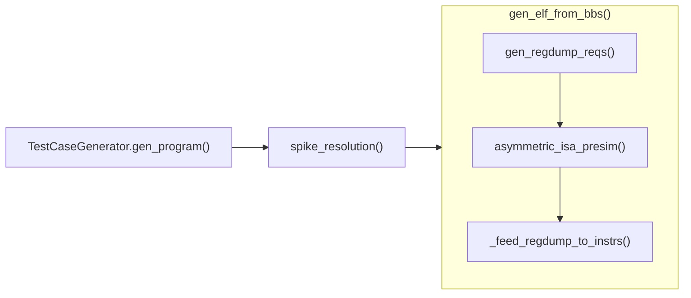

# rvgen

A standalone RISC-V instruction generator that does not depend on unrelated simulation tools or remain tightly coupled to a fuzzing framework. (still under development)

## Note for function invocation flow

