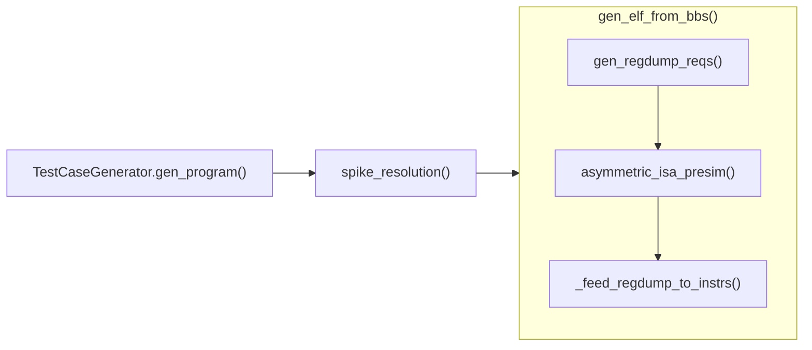

# rvgen

A standalone RISC-V instruction generator that does not depend on unrelated simulation tools or remain tightly coupled to a fuzzing framework. (still under development)

A native Rust port is available in [rvgen/](rvgen/README.md). Build it with
`cargo build --release --manifest-path rvgen/Cargo.toml`. It preserves the current
generator scaffold and includes the instruction encoders, ELF writer, and tests.

Both versions generate ELFs with an executable entry at `0x80000000`, writable
`.tohost`/`.fromhost` mailboxes, and the symbols Spike needs for automatic exit.
Normal completion writes `1` to `tohost` (success); a machine-mode trap writes `3`
(failure). The runtime is tested on RV32 and RV64. The underlying class-selection
scaffold still has no random instruction body, so default programs run the runtime
and stop; changing the seed currently does not change their ELF bytes.

Generate batches from the repository root (build Rust once before timing):

```sh
cargo build --release --locked --manifest-path rvgen/Cargo.toml
rvgen/target/release/rvgen --count 1000 --size 256 --seed 0 --out-dir elfs/rust
PYTHONPATH=src python3 -m rvgen.cli --count 1000 --size 256 --seed 0 --out-dir elfs/python
spike -m64 elfs/rust/output_000000.elf
```

`--count` defaults to 1. Batches use `output_000000.elf`, `output_000001.elf`, etc.,
and increment the initial seed for each file. `-o case.elf` changes the basename.
`--out-dir` is created when supplied; existing destination files are overwritten.
The top-level TOML configuration keys are `count` and `out_dir`, and explicit CLI
arguments override the configuration. Both commands report generation/write time
and ELF/s after all files have been written.

For repeated comparisons, `python3 scripts/benchmark.py --count 1000 --repeats 3`
runs both versions, alternates their order, and reports median wall time and speed
ratio. It includes process startup and file writes, excluding compilation,
simulation, and cleanup. Files are written to temporary directories and removed
afterward; use `--temp-dir PATH` to select the filesystem. This measures the
current class selection, runtime construction, and ELF writer, not full random
instruction generation. The Rust build must use `--release` for a useful comparison.

Validation commands:

```sh
cargo test --locked --manifest-path rvgen/Cargo.toml
PYTEST_DISABLE_PLUGIN_AUTOLOAD=1 python3 -m pytest -q
```

Spike integration tests run when `spike` is on PATH (or set `SPIKE` to its path).
The pytest command disables unrelated environment plugins. Runtime behavior follows
Spike's [HTIF symbol discovery](https://github.com/riscv-software-src/riscv-isa-sim/blob/master/fesvr/htif.cc)
and [exit request handling](https://github.com/riscv-software-src/riscv-isa-sim/blob/master/fesvr/syscall.cc).

## Note for function invocation flow


