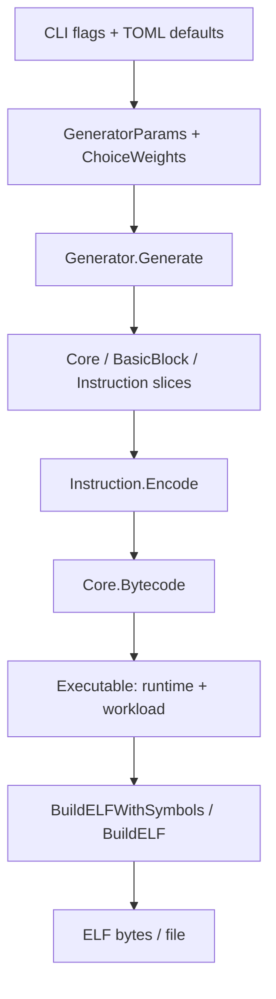

# Go design

The generator turns parameters and weighted choices into editable instructions,
then encodes those instructions into a bare-metal ELF. Two packages handle the
work: `rvgen` owns generation and output; `rvgen/riscv` owns instruction encoding
and architectural metadata.

`cli.go` applies defaults, TOML settings, then explicit flags, validates the
result, and runs the batch loop with consecutive seeds. `cmd/rvgen/main.go`
only supplies arguments and streams and converts errors to an exit status.

`GeneratorParams` is the source of generation settings. `Generator.Generate`
validates the parameters and enabled choices, seeds one RNG, divides the total
instruction budget across cores and blocks, and fills a fresh workload. It assigns
`g.Cores` only when every block succeeds. A failed run preserves the previous
instructions, labels, and selection records.

`Core` contains blocks. `BasicBlock` contains a label, instructions, and selection
records. They do not keep copies of generation parameters or run independent
generation lifecycles. Budgets are local values computed during generation;
actual instruction counts come from slice lengths. `NewGenerator` creates empty
blocks so library callers can also populate instructions explicitly.

`policy.go` distinguishes instruction classes from actions because they have
different behavior. A class selects one opcode and generates its operands. An
action emits a complete sequence, such as loading a register constant or copying
an address and loading through it. Sequences must fit entirely within a block.
The sampler temporarily excludes choices that do not fit and reports an error
when no enabled choice can finish the block. Zero-output actions cannot repeat
without progress. `SelectedChoice` records the emitted instruction range.

`riscv.Instruction` is an ordinary struct holding an opcode and operands. The
opcode table connects each kind to its encoding function, mnemonic, width,
class, and operand metadata. Encoding uses current operands, so edits cannot
leave cached bytes stale. The low-level ISA encoders remain pure bit-packing
functions. The generator derives class membership from that same table.

`Executable` adds the machine-mode entry code, trap handler, and HTIF mailboxes.
`BuildELFWithSymbols` adds symbol tables; `BuildELF` lays out sections and load
segments and writes the binary headers. These are functions because there is no
persistent builder state. `elfBytes` remains a small internal helper because it
actually owns the output buffer, ELF width, and encoding error.

The design keeps one generation lifecycle and concrete data structures. It needs
no interface hierarchy, generic pipeline, dependency container, or separate
platform framework. Reserved actions still return errors when enabled;
implementing them needs a real platform/state model. `Memsize` remains an unused
compatibility setting. ELF output currently supports one core. The assembly
template is a separate rendering path and is not used to produce ELF bytes.

## Changes from the initial Go rewrite

| Previous API | Current API |
| --- | --- |
| `CoreParams`, `BasicBlockParams` | Budgets derived from `GeneratorParams` during generation |
| `block.Params.Label` | `block.Label` |
| `core.Params.NumBBs` | `len(core.Blocks)` |
| `block.Params.NumInsts` | Derive the requested budget from top-level parameters; `len(block.Instructions)` is the actual count |
| `NewCore`, `Core.Generate`, `BasicBlock.Generate` | `NewGenerator` / `Generator.Generate`; literal cores and blocks for explicit workloads |
| `GenerationContext` in choice `Validate` / `Lower` | Pass `GeneratorParams` directly |
| `(ELFBuilder{}).Build(...)` | `BuildELF(...)` |
| `(ELFBuilder{}).BuildWithSymbols(...)` | `BuildELFWithSymbols(...)` |
| `batch.go` forwarding layer | Batch execution lives in `Run` in `cli.go` |

These are source-level library API changes. CLI flags, TOML keys, generation
policy, and seeded instruction selection are preserved. `ChoiceWeights` remains
explicit per-generator state: when switching XLEN or privilege settings after
construction, reset it with `DefaultChoiceWeights` if you want new defaults.

See [README.md](README.md) for install, run, debug, and test commands.
